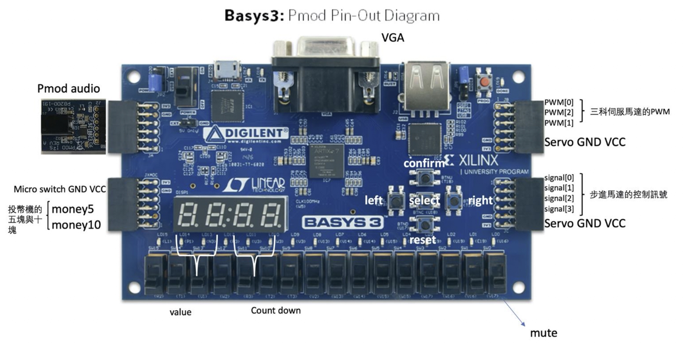
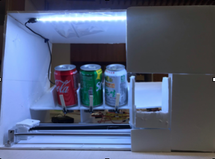
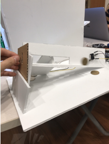
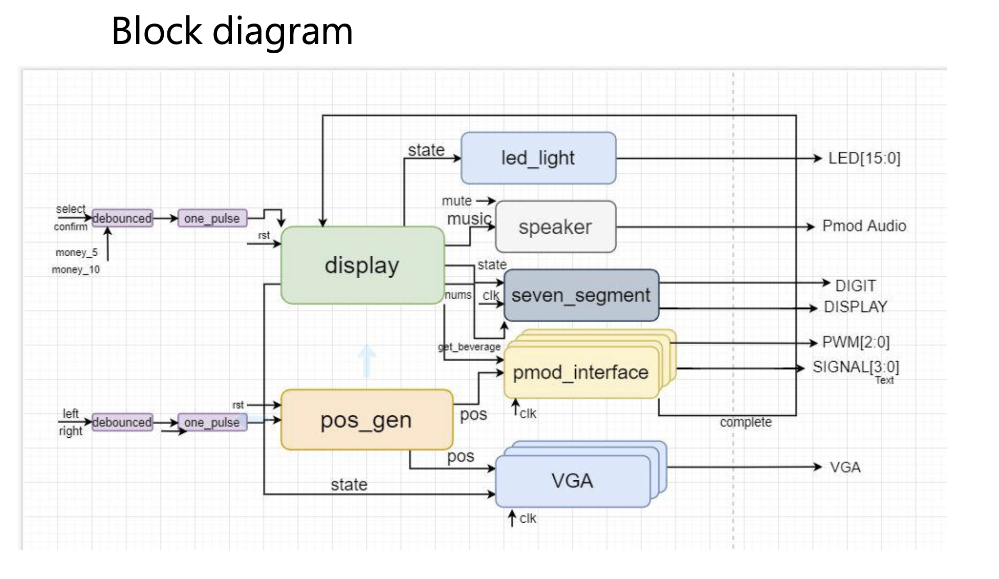

# Vending-Machine
NTHU CS. 10810 EECS207002 Logic Design Laboratory. Final Project.

Simulate a real beverage vending machine by FPGA (Basys3 board) and some physical materials.

## FPGA: Controller of the vending machine
- VGA: display the information of all the beverages (cost, remaining)
- Buttons: select a beverage / confirm purchase / moving bewteen the choices
- 7-Segment: countdown timer / display the money which already put in
- LED: purchase light effect
- Switch: mute/unmute
- Audio: BGM, purchase sound effect
- Pins: signal & voltage for servo motor

## Physical materials

### Beverage vending machine 
- Made by pearl plate (珍珠板) and servo motor (伺服馬達)
- Each kind of beverages are stored in a different slow slope with a wooden stick blocking.
- Once a beverage is purchased, the wooden stick rotates half turn to let the beverage drop down to a box. And the box will deliver the beverage to the exit by servo motor.

### Coin slot machine
- Made by pearl plate (珍珠板) and touch switch (觸動開關)
- It can distinguish 10/50 NTD by the size of the coin. We made two notches (small before big) in a slope, so the 10 NTD will drop first.
- When there's coin dropping, the corresponding touch switch will be trigger and send the signal back to the FPGA.

## Block diagram

